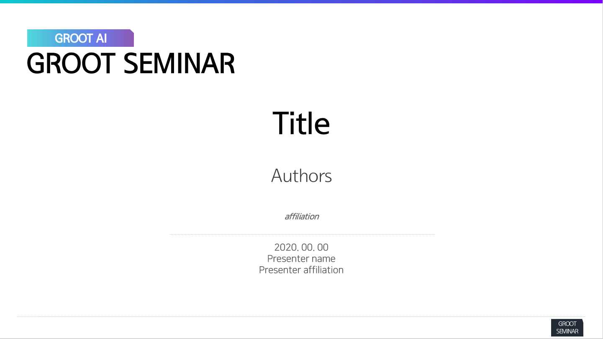

# GrootAI Technical Seminar
- https://grootai.github.io/

### Seminar Topics 
- Deep Learning
- Machine Learning 
- Statistical Learning
- Algorithms/Clean code for ML
- Mathmatics & Statistics

### Schedule (can be postponed or changed in some reason, e.g. holiday)
- Check [Issues](https://github.com/GrootAI/Groot_SEMINAR/issues)
- Reproduce seminar (Thu, 14:00 ~ 15:00)
- Tech seminar (Fri, 14:00 ~ 15:00)

### Meeting room
- Offline: Announced before seminar (via `KaKaoTalk`)
- Online: Zoom of @Jinhwan Suk (https://zoom.us/j/3885426897?pwd=UkFRQU9pdEhlOUs3VklwcjY2VHFOUT09)

### How to host a seminar
- Simply open an issue in this repository with title
  - Format: [YYYY-MM-DD] AWESOME-SEMINAR (e.g. [2010-05-20] [how to train your dragon](https://www.imdb.com/title/tt0892769/))
- Ground rules
  - Anyone can present any topic 
  - You can download our official [ppt template](https://drive.google.com/file/d/1VIJr9vvQYGFJWpO32gsnGVVApetojBJe/view?usp=sharing)
  - Don't have to present about a published paper or an official material (e.g. you can present something like your know-how)
- Some recommendations
  - If there are any references or materials (e.g. your own PPT, blog article, or paper link), please list up them in the body of issue before the seminar
  - Please use `labels` in github as tags, so we can categorize our materials (and if there is no related label, [please make one](https://stackoverflow.com/questions/29218900/how-to-create-custom-labels-for-issues-on-github))
  - Please open an issue at least a day before the seminar and close the issue after it is presented (if you forget, simply open-and-close an issue after the seminar)
  - After seminar, it would be perfect if we can share our discussion during the seminar as comments
  
### Other things to know
- Slideshare: https://www.slideshare.net/SEMINARGROOT
- YouTube: https://www.youtube.com/channel/UC257FbjhRGK9MMHyXXAyrTg
- Google Drive: https://bit.ly/3c40fEi
- Linkedin Group: https://www.linkedin.com/groups/10542314/
  

